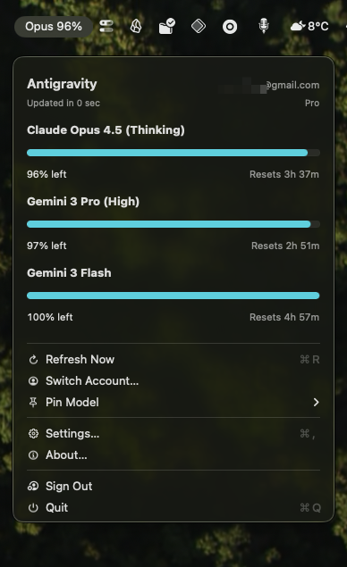

# AntigravityUsageWatcher

A macOS menu bar app that shows your Antigravity quota usage.

## Overview

AntigravityUsageWatcher runs in your macOS menu bar and shows:

- Your account/plan (when available)
- Per-model quota remaining + reset times

It signs in with Google (same account you use with Antigravity) and fetches usage by spawning Antigravity’s bundled local language server.

## Screenshot



## Requirements

- macOS
- Xcode (for building)
- Antigravity installed at `/Applications/Antigravity.app`
  - This app spawns Antigravity’s bundled language server from inside the Antigravity app bundle.

## Install (personal use)

### Option A: Archive from Xcode (recommended)

1. Open `AntigravityUsageWatcher.xcodeproj` in Xcode.
2. Select scheme `AngravityUsageWatcher` and destination `Any Mac`.
3. `Product` → `Archive`.
4. In Organizer, select the archive → `Distribute App` → `Copy App`.
5. Move the exported `AntigravityUsageWatcher.app` into `/Applications`.

### Option B: Build from terminal

Build a Release app:

```sh
xcodebuild \
  -project "AntigravityUsageWatcher.xcodeproj" \
  -scheme "AngravityUsageWatcher" \
  -configuration Release \
  -destination 'platform=macOS' \
  build
```

Xcode will place the built `.app` under DerivedData. You can then copy it into `/Applications`.

## First run / Gatekeeper

If macOS blocks the app (because it’s not notarized):

- System Settings → Privacy & Security → scroll to the warning → `Open Anyway`.

## Troubleshooting

- App doesn’t show in Dock (expected): This app sets `LSUIElement` and runs as a menu bar app; look for it in the menu bar.
- “Failed to fetch quota” / can’t connect to local server: Ensure Antigravity is installed at `/Applications/Antigravity.app`, then relaunch this app.
- Sign-in hangs or times out: Try again; ensure your browser opens and completes the redirect back to the loopback URL.
- TLS / certificate errors: AntigravityUsageWatcher pins Antigravity’s shipped `cert.pem`. Reinstall/update Antigravity if the certificate or paths changed.
- Need logs: Run from Terminal with `ANTIGRAVITY_DEBUG_LOGS=1` (or enable the Debug logs setting in-app, if present).

## Notes

- The app expects Antigravity at `/Applications/Antigravity.app`. If it’s elsewhere, install/move it there.
- For personal use, the app icon and status bar icon are derived from the local Antigravity installation. If you plan to redistribute, replace icons with your own assets.
